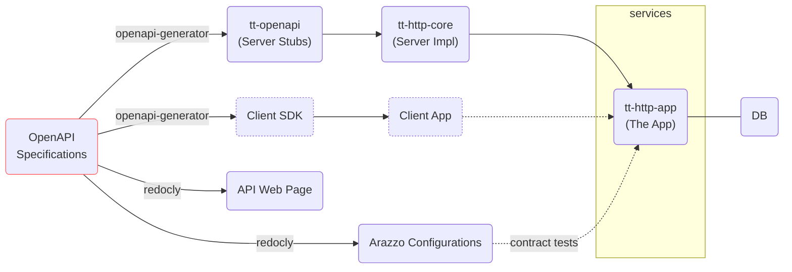

<!-- markdownlint-disable MD033 -->
<h1 align="center">tt</h1>

<div align="center">

[](https://github.com/whisperpine/tt/blob/main/LICENSE)
[](https://github.com/whisperpine/tt/actions/workflows/checks.yml)
[](https://github.com/whisperpine/tt/actions/workflows/build.yml)
[](https://github.com/whisperpine/tt/releases)
[](https://github.com/whisperpine/tt/deployments/openapi-docs)

Generate rust server stubs based on OpenAPI Specifications,
reduce boilerplates and ensure consistency.

</div>

## Background

With OpenAPI design finalized upfront, we can achieve:

- Efficiency:
  save development time by automatically generate server stubs and client SDKs.
- Consistency:
  ensure server and client code align with a predefined contract, reducing mismatches.
- Maintainability:
  make changes to the API in the specification first,
  work on auto-generated code later.

## How It Works

OAS files under [./openapi](./openapi/) work as the *Single Source of Truth*:

- Design and write OAS ([OpenAPI Specifications](https://www.openapis.org/)) files.
- Generate server stubs (axum is used in this repo) by [openapi-generator-cli](https://github.com/OpenAPITools/openapi-generator).
- Lint OAS files by [redocly](https://github.com/Redocly/redocly-cli)
  and generated HTML which is deploy on [GitHub Pages](https://whisperpine.github.io/tt/).
- Run contract tests by [Arazzo](https://www.openapis.org/arazzo-specification),
  generated by [redocly](https://github.com/Redocly/redocly-cli)
  according to OpenAPI Specifications.



## Prerequisites

Dev environment is managed by [nix-direnv](https://github.com/nix-community/nix-direnv),
which stitches nix flakes and [direnv](https://github.com/direnv/direnv).
It automatically sets up environment variables and runs `nix develop` every time
you `cd` into the project directory.

```sh
# You only need to run `dirnev allow` ONCE after git clone.
# Then every time you `cd`, the dev environment will be loaded automatically.
cd THIS_REPO && dirnev allow
```

## Get Started

Host the service locally by docker and run OpenAPI contract tests:

```sh
git clone THIS_REPO && cd THIS_REPO

# Setup dev environment described in the "Prerequisites" above,
# or at least install these tools: just, redocly, rust toolchain.

# Run the backend application and dependent services.
just spin-up
# Run OpenAPI contract tests by Arazzo (in ANOTHER terminal).
just arazzo
```

## Explore

Run `just -l` to see commonly used commands in this repo:

```txt
Available recipes:
    [OpenAPI]
    arazzo  # run OpenAPI contract tests by Arazzo
    bundle  # bundle OpenAPI Specifications in to a single file
    doc     # generate API documentation as an HTML file
    lint    # lint OpenAPI Specifications

    [Rust]
    gen     # generate server stubs with rust-axum generator
    run     # run the openapi server in debug mode
    spin-up # spin up docker compose services and run the backend app

    [SQL]
    fix     # fix SQL linting errors found by sqlfluff
```
