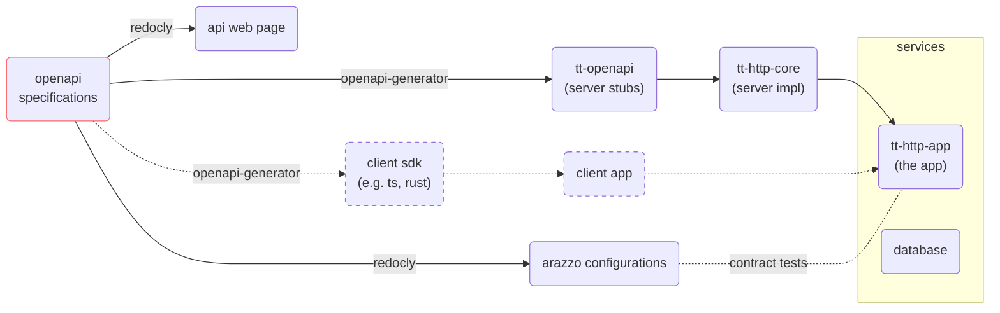

# tt

[](https://github.com/whisperpine/tt/commits/main/)
[](https://github.com/whisperpine/tt/blob/main/LICENSE)
[](https://github.com/whisperpine/tt/actions/workflows/checks.yml)
[](https://github.com/whisperpine/tt/actions/workflows/build.yml)
[](https://github.com/whisperpine/tt/deployments/github-pages)

An OpenAPI driven rust server.

OAS files under [./openapi](./openapi/) work as the *Single Source of Truth*:

- Design and write OAS ([OpenAPI Specifications](https://www.openapis.org/)) files.
- Generate server stubs (axum is used in this repo) by [openapi-generator-cli](https://github.com/OpenAPITools/openapi-generator).
- Lint OAS files by [redocly](https://github.com/Redocly/redocly-cli)
  and generated HTML which is deploy on [GitHub Pages](https://whisperpine.github.io/tt/).
- Run contract tests by [Arazzo](https://www.openapis.org/arazzo-specification),
  generated by [redocly](https://github.com/Redocly/redocly-cli)
  according to OpenAPI Specifications.



## Prerequisites

Dev environment is managed by Nix Flakes.
If you're not using nix, it's required to manually install tools listed in the
`packages` section of [flake.nix](./flake.nix).
Otherwise you can just run the following command to enter dev environment:

```sh
# `nix develop` needs to be run every time you `cd` in.
cd THIS_REPO && nix develop
```

[nix-direnv](https://github.com/nix-community/nix-direnv)
is highly recommended.
It automatically runs `nix develop` every
time you `cd` to the project.

```sh
# `dirnev allow` needs to be run only once.
# After that, when you `cd` in, nix dev env will be automatically loaded.
cd THIS_REPO && dirnev allow
```

## Get Started

Host the service locally by docker and run OpenAPI contract tests:

```sh
git clone THIS_REPO && cd THIS_REPO

# Setup dev environment described in the "Prerequisites" above,
# or at least install these tools: just, redocly.

# Note: edit ./.env file per your preference.
cp ./example.env ./.env
# Run tt-http-app and dependent services.
docker compose up -d
# Run OpenAPI contract tests by Arazzo.
just arazzo
```

## Explore

Run `just -l` to see commonly used commands in this repo:

```txt
Available recipes:
    arazzo # run OpenAPI contract tests by Arazzo
    build  # build the docker image for the local machine's platform
    buildp # build multi-platform docker images (linux/amd64,linux/arm64)
    bundle # bundle OpenAPI Specifications in to a single file
    doc    # generate API documentation as an HTML file
    gen    # generate server stubs with rust-axum generator
    lint   # lint OpenAPI Specifications
    run    # run the openapi server in debug mode
```
